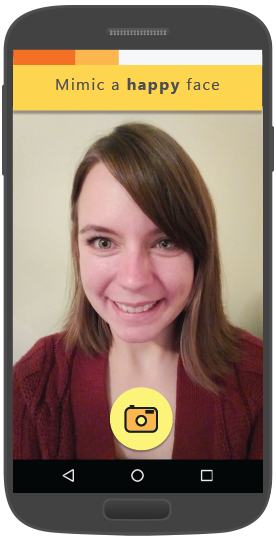
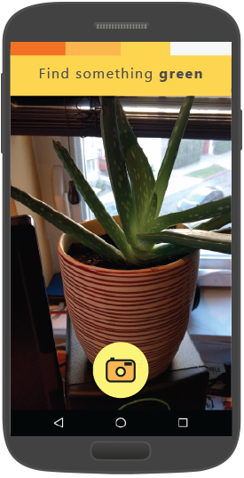
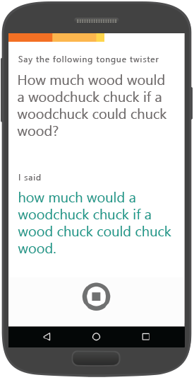

Mimicker Alarm, a Microsoft Garage Project
====================================
Mimicker Alarm is a morning alarm clock app for Android that helps you wake up and stay up by playing a simple game, called a "Mimic". To dismiss your alarm, you must mimic the action given, lest your alarm ring again. Each game is powered by [Microsoft Project Oxford](<https://www.projectoxford.ai>), a set of machine learning APIs aimed at helping developers understand and act on the data around them.

Express yourself with [Emotion API](<https://www.projectoxford.ai/emotion>) | Color capture with [Computer vision API](<https://www.projectoxford.ai/vision>) | Tongue twister with [Speech API](<https://www.projectoxford.ai/speech>)
------------- | ------------- |  -------------
![Express yourself] | ![Color capture] | ![Tongue twister]

You can install [Mimicker Alarm in the Google Play Store](<https://play.google.com/store/apps/details?id=com.microsoft.mimicker>) for free. All of the source code for Mimicker Alarm is available on GitHub for developers to browse and reference how to use [Microsoft Project Oxford](<https://www.projectoxford.ai>). We welcome your comments, feedback, and contributions.

Contributing
============
We welcome contributions and are always looking for new ideas, input, and
suggestions. Feel free to file issues on the repo and we'll address them as we can. You can also learn more about how you can help on the [Contribution
Rules & Guidelines](</CONTRIBUTING.md>).

Getting started
===============

Build the app
----------------

1. Get a subscription key for Face, Vision, and Speech API by following instructions in [Project Oxford](<https://www.projectoxford.ai/>).

2.  Start Android Studio and open project.

3.  In Android Studio -\> "Project" panel -\> "Android" view, open file "gradle.properties", provide the keys

4.  In Android Studio, select menu "Build -\> Make Project" to build the app

PS: if you have a [Mixpanel](<http://www.mixpanel.com>) account or [HockeyApp](<http://www.hockeyapp.net>) account you can put in those keys to get event logging, update notifications and crash reports.

Run the sample
--------------

In Android Studio, select menu "Run", and "Run app" to launch this app.

Microsoft will receive the images you upload and may use them to improve Face API and related services. By submitting an image, you confirm you have consent from everyone in it. This is outlined in the in-app Terms of Use.

Creating new mimics
-----------

You can create new mimics really easily!
Inherit from the MimicWithCameraFragment class and implement the verify function that takes in a Bitmap. You can readily use the Emotion API and Vision API!

For more Project Oxford APIs just include their maven packages.

For the new Mimic to show up, include it in pref_mimics so users can enable/disable it.
Finally add the class into the MimicFactory class.

License
=======

All Project Oxford SDKs and samples are licensed with the MIT License. For more details, see
[LICENSE](</LICENSE.md>).

Sample images are licensed separately, please refer to [LICENSE-IMAGE](</LICENSE-IMAGE.md>).
